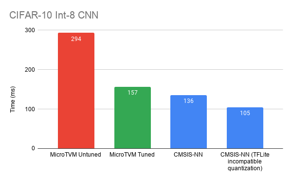

MicroTVM is an effort to run TVM on bare-metal microcontrollers. You can read more about the current
design in the original [Standalone microTVM Roadmap](https://discuss.tvm.apache.org/t/rfc-tvm-standalone-tvm-roadmap/6987).
This repo shows you how to run CIFAR10-CNN on the host machine and on an [STM Nucleo-F746ZG development board](
https://www.st.com/en/evaluation-tools/nucleo-f746zg.html).



## Hardware you will need

* A machine capable of running the [microTVM Reference Virtual Machines](https://tvm.apache.org/docs/tutorials/micro/micro_reference_vm.html#sphx-glr-tutorials-micro-micro-reference-vm-py), or a Linux machine with TVM and Zephyr installed.
* [STM Nucleo-F746ZG development board](https://www.st.com/en/evaluation-tools/nucleo-f746zg.html)
    * Autotuning can be sped up by adding more of these development boards.
* micro USB cable

## Software you will need

* A recent version of Linux (TVM tests against Ubuntu 18.04).
* Python 3.6+

## Getting Started

1. Clone this repository (use `git clone --recursive` to clone submodules).
2. Clone the TVM repo: `git clone --recursive https://github.com/apache/tvm tvm`
3. (A temporary step) Patch [PR 6948](https://github.com/apache/tvm/pull/6948) and
   [PR 7001](https://github.com/apache/tvm/pull/7001):
   $ git fetch origin/main
   $ git fetch https://github.com/areusch/incubator-tvm.git utvm-custom-malloc  # PR 6948
   $ git cherry-pick origin/main..FETCH_HEAD
   $ git fetch https://github.com/areusch/incubator-tvm.git reference-vm-build  # PR 7001
   $ git cherry-pick origin/main..FETCH_HEAD

3. Setup the [microTVM Reference VM](https://tvm.apache.org/docs/tutorials/micro/micro_reference_vm.html).
 * __NOTE__: Use this `vagrant up` command instead of the one given there:

     $ TVM_PROJECT_DIR=path/to/microtvm-blogpost-eval vagrant up --provider=<provider>

4. Attach the USB device to the Reference VM.

Choose `virtualbox` or `parallels` for `<provider>`, depending which VM hypervisor is installed.
`vmware` support isn't available yet, but we're working on it.

## Running host-driven

You can run the model in a host-driven configuration with the following command:

```bash
$ python -m micro_eval.bin.eval cifar10_cnn:micro_dev:data/cifar10-config-validate.json --validate-against=cifar10_cnn:interp:data/cifar10-config-validate.json
```

This command builds a Zephyr binary and flashes it to the device. It also builds a similar model to run on the host.
It drives both models with the same inputs and displays the output in terminal.

### Using Jupyter notebook

This process is captured in the Jupyter notebook in `tutorial/standalone_utvm.ipynb`. You can run this as follows:

1. (If running on the Reference VM) In the `tvm` repo, edit `apps/microtvm/reference-vm/zephyr/Vagrantfile`
   and add a line as follows:

   config.vm.network "forwarded_port", guest: 8090, host: 8090

2. Bounce the VM:

    ```bash
    $ vagrant halt
    $ TVM_PROJECT_DIR=path/to/microtvm-blogpost-eval vagrant up
    ```

3. Install jupyter: `$ pip3 install jupyter`

4. Launch the notebook. In this blogpost repo, run `$ python -mjupyter notebook --no-browser --port 8090 --ip=0.0.0.0`

Copy the `127.0.0.1` URL from your console to your browser. This should bring up Jupyter notebook--navigate to
`tutorials/standalone_utvm.ipynb` and you should be set.

## Running standalone

You can also run the Relay CIFAR10 model standalone on-device. First, translate the model into C in the standalone project:

```bash
$ python -m micro_eval.bin.standalone generate
```

Now, flash the project onto the device using _Zephyr_ commands:

```bash
$ cd standalone
$ west build -b <your_board>
$ west flash
```

## Running autotuning

__NOTE__: This section is WIP with the new on-device runtime.

## Debugging

There are a lot of moving pieces here and it's easy for the system to fail. Here I've tried to document
some of the problems you can run into, and how to solve them.

Generally speaking, first try to enable debug logs with `--log-level=DEBUG`.

### RPC server times out

You may see cases where the RPC server times out waiting for the session to be established. This can
happen for several reasons:

1. A communication problem between the board and VM. Sometimes the serial port can drop bytes. Try
   unplugging the board and re-attaching it several times, which may clear it up.
2. A fault occurs on the device at startup. Try editing the script in question and set the `DEBUG`
   variable to `True`. Then, open another terminal and launch
   `python -mtvm.exec.microtvm_debug_shell`. This window will show the debugger while the script is
   running. Finally, re-run the edited script in your other terminal. You should see GDB appear in
   the `microtvm_debug_shell` window and the script will pause at a prompt to let you set up the
   debugger. To solve session establishment problems, try debugging the UART connection or the
   main() startup.

If the RPC server times out later on, it's likely there's been a fault in operator execution. Use
the approach from point 2 above, and set a breakpoint at `TVMFuncCall` or the function in question.
